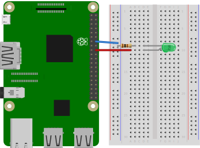

# blinking-led
This small project makes a LED blink by using nothing but a Raspberry Pi, some electrical components and
C/C++.
After finishing this project, you should be able to see the LED blinking.

We assume, that you are already familiar with C++, understand
the basics of Raspberry Pi I/O and know how to connect to the Raspberry Pi.

## Table of contents
1. [Components](#components)
2. [Design](#design)
3. [Circuit Diagram](#circuit-diagram)
4. [Dependencies](#dependencies)
5. [Code](#code)
6. [Run application](#run-application)
7. [Notes](#notes)
    1. [Parallel LED Design](#parallel-LED-design)
    2. [Parallel LED Circuit Diagram](#parallel-LED-circuit-diagram)
8. [Further reading](#further-reading)

## Components
- 1x Raspberry Pi 3
- 1x Breadboard
- 1x 100&Omega; resistor
- 1x LED (color does not really matter, we used a green one)
- 2x Female-to-male jumper wires

## Design


*Diagram created using [Fritzing](https://fritzing.org/home/)*

## Circuit Diagram
Assuming, that the Raspberry is just an AC source, and using a green LED, which has a voltage drop of 2.3V, we can
calculate the required resistor.


The circuit can then be displayed as


*Diagram created using [EasyEDA](https://easyeda.com/)*

## Dependencies
In order to be able to use the RaspberryPi with C++, we need to install the `pigpio` library.
Luckily, the Raspberry community has already provided this library in the general repository and can be installed with
```shell
sudo apt-get update
sudo apt-get install pigpio
```

## Code
First we need to include the `pigpio` library, which handles the communication with the Raspberry Pi.
```c
#import <pigpio.h>
``` 
Second, we need to setup the environment.
This can be done with
```c
if (gpioInitialise() < 0) {
    return 1;
}
```
Now we can configure the pin we're going to use.
This library uses the BCM pin numbering, therefore GPIO 24 (pin number 18) is just referenced as '24'.
We use GPIO 24 (pin 18) and since we use it as an output, we need to set this pin to `PI_OUTPUT`.
```c
int pinNumber = 24;
gpioSetMode(pinNumber, PI_OUTPUT);
``` 
Now we need to write the method for making the LED blink.
Blinking is just a toggling of the High (on) and Low (off) states.
This can be done with
```c
gpioWrite(pinNumber, 1);    // on
time_sleep(1);
gpioWrite(pinNumber, 0);    // off
time_sleep(1);
```
For making the LED blink three times, we can include the above code in a loop.
With this we have completed this quick tutorial.

As a reference, the full code can be found in the [index.c](./src/index.c) file.

## Run application
Open the console in the directory in which you stored your code on your Raspberry Pi.

To run the application, type
```shell script
gcc index.c -lpigpio -lpthread -o index
sudo ./index
```
in the console.
After a short time, the LED should start blinking and stop after blinking three times.

## Notes
Using the same code, it is also possible to make multiple LEDs blink at the same time.
For each LED that we add, we need

- 1x Male-to-male jumper wire
- 1x 100&Omega; resistor

In the example we use five parallel green LEDs.
### Parallel LED Design


*Diagram created using [Fritzing](https://fritzing.org/home/)*

### Parallel LED Circuit Diagram


*Diagram created using [EasyEDA](https://easyeda.com/)*

## Further reading
The next two projects we will look at, are similar to this one.
They involve using multiple GPIO pins to make the LEDs blink at different times.
<!--
1. [Traffic Light](../traffic-light)
2. [Binary Counter](../binary-counter)
-->
